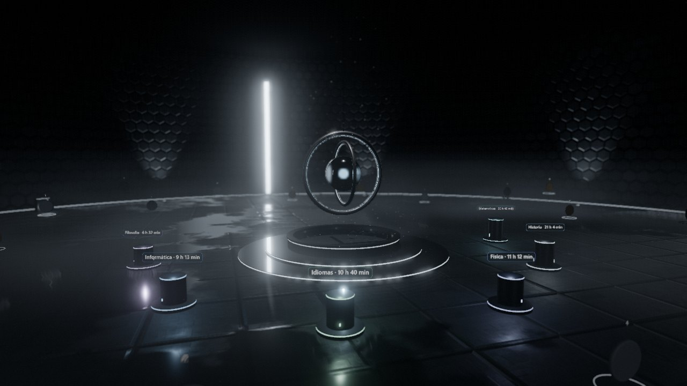

# Laboratorio de Estudio

**Un diario de estudio gamificado dentro de una bóveda 3D.** Registras cada
sesión de estudio y la sala reacciona: el reactor late más fuerte con tu racha,
cada materia levanta su propia columna y los logros se convierten en medallones
de metal.



La escena imagina un museo futurista sellado durante milenios y recién
descubierto: sala a oscuras, paneles hexagonales, una rendija de luz a
contraluz, suelo mojado, polvo en suspensión y una radio que sigue emitiendo
sola al fondo.

Todo es procedural: sin modelos 3D, sin texturas descargadas, sin ficheros de
audio y sin backend.

## Qué hace

- **Registro de sesiones**: fecha, materia, tema, duración, dificultad y
  energía, con notas opcionales.
- **Progreso**: racha de días, XP y niveles con título, heatmap de constancia,
  ritmo semanal y desglose por materia.
- **22 logros** en cuatro rangos (bronce, plata, oro, leyenda), con progreso
  parcial visible.
- **La escena como vista de datos**: la altura de cada columna son tus horas
  (en escala logarítmica), su ranura de luz es su peso sobre el total y el
  reactor es tu racha.
- **Exportar e importar** en JSON para respaldar o migrar tus datos.

## Aspectos técnicos destacables

- **Simulación de agua en GPU.** La fuente resuelve la ecuación de onda en una
  malla de 256×256 con `GPUComputationRenderer`: velocidad de propagación
  explícita, pared reflectante tipo Neumann y absorción en el borde. De la
  misma malla salen las normales del reflejo y las cáusticas del fondo.
- **Niebla volumétrica.** Un pase de post-proceso hace raymarching contra el
  buffer de profundidad de la escena. La niebla se ilumina solo donde le llega
  luz y la arrastran tres corrientes de viento con ráfagas aleatorias. Las
  mismas corrientes mueven 24 000 motas de polvo, animadas por completo en el
  vertex shader.
- **Iluminación física.** Materiales PBR con mapas de rugosidad y normales
  generados en canvas, luces de área (`RectAreaLight`), un mapa de entorno
  construido a partir de la propia sala y tone mapping AgX. El suelo mojado
  combina una máscara de charcos en coordenadas de mundo con un reflejo real
  difuminado.
- **Sonido procedural y espacial.** Todo es Web Audio, sin un solo fichero de
  audio: zumbido del reactor, viento, gotas que suenan en su punto de impacto,
  una radio de onda corta (estática, voz por síntesis de formantes, morse) y
  una reverberación de bóveda generada. De cerca, cada fuente suena nítida; de
  lejos, sobre todo su eco.
- **Lógica pura y testeada.** Toda la lógica de negocio (rachas, XP, logros,
  estadísticas, parámetros de sonido) vive en `src/core/`, sin DOM ni Three.js,
  y se verifica en Node con 107 comprobaciones.

## Stack

- **Vite + Three.js**, sin framework de UI: la interfaz es DOM plano.
- **Shaders GLSL propios** para el agua, la niebla, el polvo y el suelo.
- **Web Audio API** para todo el sonido.
- **localStorage** para los datos, con fallback en memoria (modo privado).

## Puesta en marcha

```bash
npm install
npm run dev      # servidor de desarrollo
npm test         # 107 comprobaciones de la lógica central
npm run build    # bundle de producción
```

## Controles

- **Arrastrar**: orbitar. **Rueda**: zoom.
- **Clic en un medallón**: la cámara lo enfoca. **Clic en el vacío**: vuelve a
  la vista general. **Clic en el agua**: la agitas.
- **Teclado**: `N` abre el registro; `1` a `4` cambian de pestaña (registro,
  progreso, logros, historial).
- **Barra superior**: `SON` (sonido), `LUZ` (rendijas del muro), `DOF`
  (profundidad de campo), `AUTO` (cámara automática) y `⌂` (vista general).

El sonido arranca con tu primer clic o tecla: los navegadores no permiten
reproducir audio antes.

## Cómo funcionan las mecánicas

**Racha.** Días consecutivos con al menos una sesión. Si hoy todavía no has
estudiado pero sí ayer, la racha sigue viva: solo se rompe tras dos días
completos sin estudiar.

**XP.** 1 XP por minuto (con techo a las 4 h para no premiar maratones), más
8 por punto de dificultad y 4 por punto de energía.

**Niveles.** Curva `100 · (nivel - 1)^1.55`: sube rápido al principio y exige
constancia real después. Cada rango tiene título (Aprendiz → Director de
Investigación).

## Estructura

```
src/
  core/            Lógica pura, sin DOM ni Three.js (testeable en Node)
    date.js        Fechas en hora local, semanas ISO
    model.js       Esquema de sesión y validación
    storage.js     Persistencia en localStorage
    stats.js       Rachas, totales, heatmap, desgloses por materia
    gamification.js  XP, niveles, 22 logros
    soundscape.js  Parámetros de sonido (distancia, viento, gotas, morse)
    store.js       Estado reactivo y CRUD
    selftest.js    Suite de comprobaciones
  scene/           Escena 3D
    lab.js         Orquestador: cámara, bucle, interacción
    environment.js Sala: muro, suelo, rendijas de luz, tarima, transmisor
    reactor.js     Giroscopio con núcleo de luz (la racha)
    fountain.js    Agua con simulación de ondas en GPU
    towers.js      Columnas por materia
    pedestals.js   Medallones de logro
    wet.js         Suelo mojado y reflejos
    wind.js        Corrientes de aire compartidas
    air.js         Cuánta luz recibe un punto del aire
    dust.js        Polvo en suspensión
    mist.js        Niebla volumétrica (post-proceso)
    audio.js       Sonido de ambiente
    postfx.js      Bloom, DOF, viñeta y grano
    palette.js     Paleta única de luz y materiales
    textures.js    Texturas procedurales
  ui/              Interfaz DOM
    hud.js         Nivel, XP, racha, controles, avisos
    logForm.js     Formulario de registro
    panels.js      Heatmap, materias, ritmo semanal, historial
    achievements.js  Rejilla de logros con progreso
```

## Datos

Todo vive en tu navegador, en `localStorage` bajo la clave `studyforge.v1`.
Nada sale de tu equipo. Los botones **Exportar** e **Importar** permiten
respaldar y migrar los datos en JSON.

## Ampliable

- **Backend**: `storage.js` está aislado tras `load` / `save` / `import` /
  `export`. Implementar esas cuatro funciones contra una API REST basta para
  pasar a multi-dispositivo sin tocar nada más.
- **Texturas generadas**: `tools/generate-textures.mjs` produce texturas con
  ComfyUI a través de su API HTTP, y la app las carga como ficheros estáticos
  si existen. Las procedurales funcionan sin nada externo.
